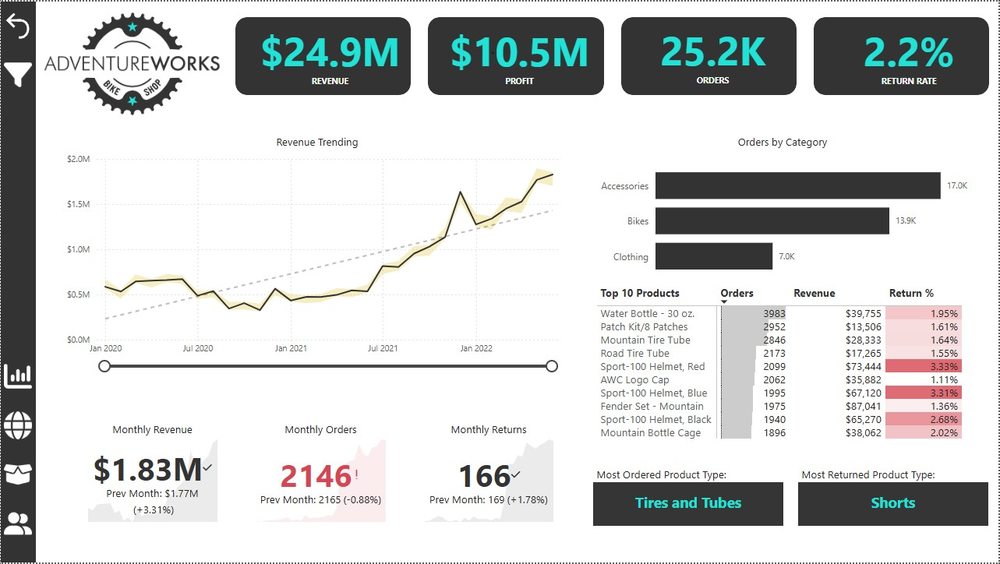
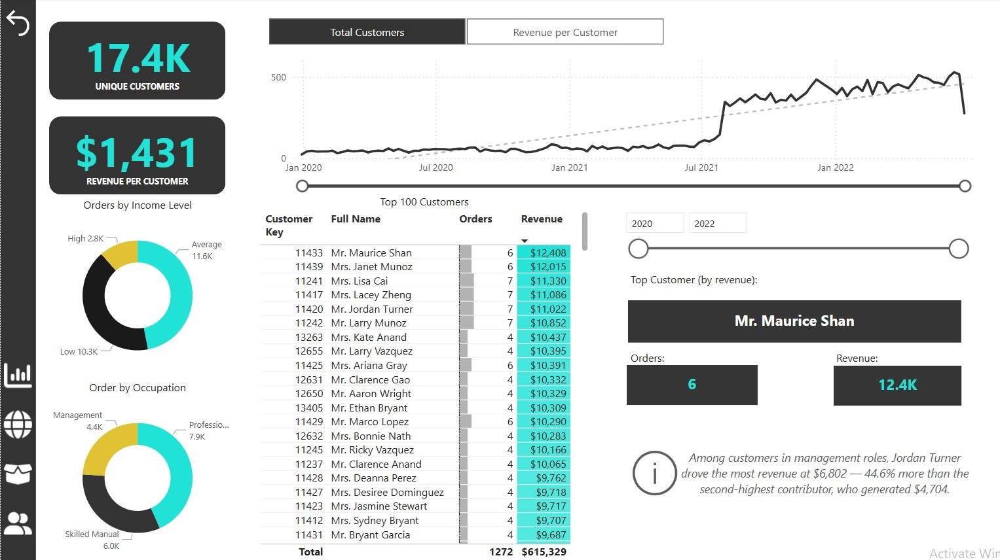
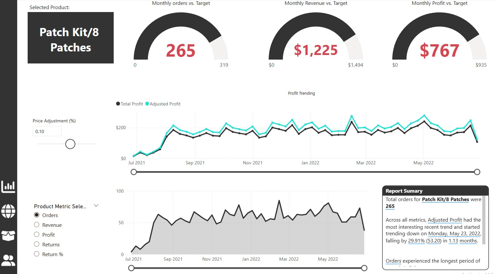
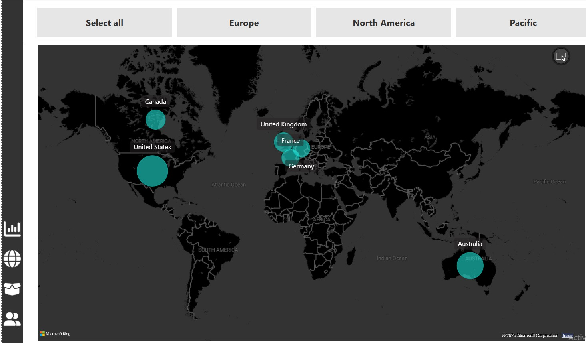
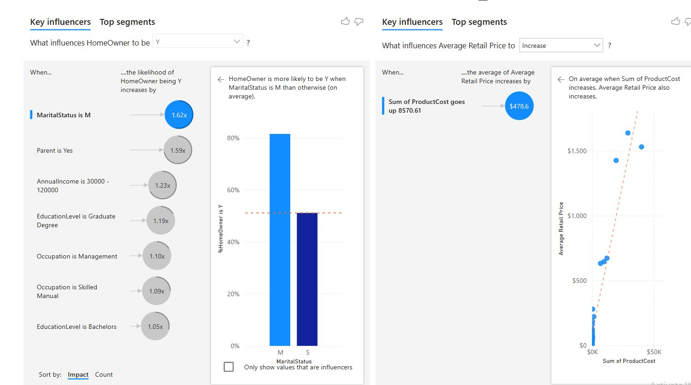
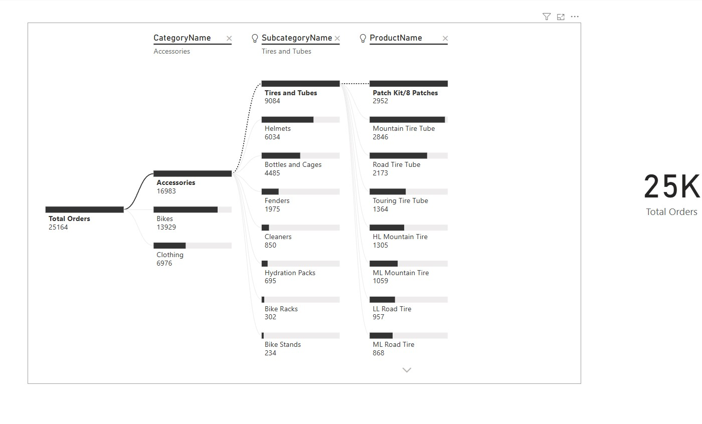

# AdventureWorks Bike Shop - Power BI Dashboard

This project is a data visualization dashboard built with Power BI for a fictional bike company, **AdventureWorks**. It showcases sales, customer behavior, geographic distribution, product performance, and key influencers across several dashboard visuals.

## 📊 Dashboard Features

- Executive Summary: Revenue, Profit, Orders, Return Rate
- Customer Insights: Income levels, Occupation, Revenue per customer
- Product Analytics: Order trends, Profit analysis, Key influencers
- Geographic Sales: Regional distribution of customers
- Decomposition Tree: Order breakdown by product categories

## 📁 Project Structure

- `AdventureWorks Report.pbix` – Main Power BI report file
- `README.md` – Project overview and instructions
- `images/` – Exported screenshots of dashboard pages
- `data/` – All raw CSV datasets used for building the report
- `icons/` – Custom icons used within the Power BI interfac

## 📷 Screenshots

### Executive Dashboard  

### Customer Detail  

### Product Detail  

### Map View  

### Key Influencers  

### Decomposition Tree  

---
## 🗃️ Data Sources

The `/data` folder contains all raw CSV files used to build the Power BI report:

- **Sales Data**: 
  - `AdventureWorks Sales Data 2020.csv`
  - `AdventureWorks Sales Data 2021.csv`
  - `AdventureWorks Sales Data 2022.csv`

- **Lookup Tables**:
  - `AdventureWorks Calendar Lookup.csv` – Date dimension
  - `AdventureWorks Customer Lookup.csv` – Demographics, geography
  - `AdventureWorks Product Lookup.csv` – Product details
  - `AdventureWorks Product Categories Lookup.csv` – Category info
  - `AdventureWorks Product Subcategories Lookup.csv` – Subcategory info
  - `AdventureWorks Territory Lookup.csv` – Sales territory data

- **Returns Data**:
  - `AdventureWorks Returns Data.csv` – Product returns tracking

 ---
 
## 📌 Tools Used

- Microsoft Power BI
- DAX (Data Analysis Expressions)
- Power Query

## 🚀 Getting Started

1. Clone the repository.
2. Open the `.pbix` file in Power BI Desktop.
3. Explore, customize, and analyze!

## 🧠 Key Insights

- Revenue per customer averaged $1,431.
- Key customer: Mr. Maurice Shan ($12.4K revenue).
- Orders rose significantly after mid-2021.
- Highest product orders: Water Bottle 30 oz and Patch Kit/8 Patches.

---

*This project is a fictional case study and not affiliated with any real company.*
